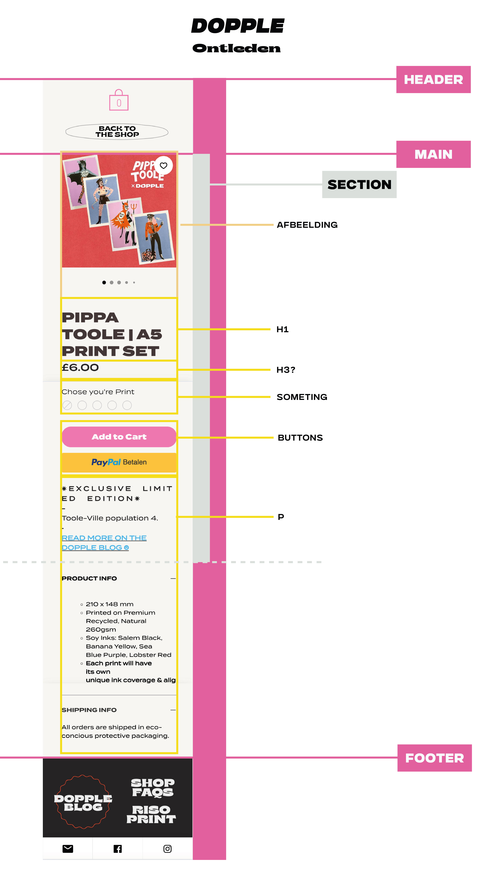

# Procesverslag
Markdown is een simpele manier om HTML te schrijven.  
Markdown cheat cheet: [Hulp bij het schrijven van Markdown](https://github.com/adam-p/markdown-here/wiki/Markdown-Cheatsheet).

Nb. De standaardstructuur en de spartaanse opmaak van de README.md zijn helemaal prima. Het gaat om de inhoud van je procesverslag. Besteedt de tijd voor pracht en praal aan je website.

Nb. Door *open* toe te voegen aan een *details* element kun je deze standaard open zetten. Fijn om dat steeds voor de relevante stuk(ken) te doen.

## Jij

  
uitwerken voor kick-off werkgroep

  ### Auteur:
  Maaike Schoute

  #### Je startniveau:
  Rood

  #### Je focus:
  Responsive
 

## Je website

  
uitwerken voor kick-off werkgroep

  ### Je opdracht:
  (https://www.dopplepress.com/)

  #### Screenshot(s) van de eerste pagina (small screen): 
  Home  
  

   #### Screenshot(s) van de eerste pagina (big screen): 
  Home  
    

  #### Screenshot(s) van de tweede pagina (small screen):
  Shop  
  

   #### Screenshot(s) van de tweede pagina (big screen):
  Shop  
  
 

## Toegankelijkheidstest 1/2 (week 1)

  
uitwerken na test in 2e werkgroep

  ### Bevindingen
  WCAG cheklist

  <strong>Content:</strong> Dit bepaald hoe goed de gebruiker begrijpt welke informatie er op de site staat.
  - De taal waarin deze site is geschreven, is simpel, en makkelijk te begrijpen voor elke doelgroep. Zelfs met de vaktermen die erin worden vernoemd.
  - Elke button is uniek en heeft een goede beschrijving.

  <strong>Global Code:</strong> De code beïnvloed de hele site.
  - Via deze link:  https://validator.w3.org/nu/?doc=https%3A%2F%2Fwww.dopplepress.com%2F, ben ik erachter gekomen dat de site niet semantisch is, en dat de code nog veel schoner kan.
  - De site gebruikt een 'lang: en' enelement.
  - Niet elke pagina heeft een unieke titel.
  - Je kan inzoomen op de pagina met je vingers, of met de muis.

  <strong>Keyboard:</strong> De site kan gebruikt worden met het gebruik van het toetsenbord. Blinde mensen kunnen met tab van onderwerp springen.
  - De linkjes hebben geen duidelijke namen. Het is lastig te bepalen wat er gaat gebeuren als je met de tab op een link staat. 
  - Er is een visuele foces, waarin je kunt zien welk onderdeel van de pagina is geselecteerd. 
  - De volgorde gaat ook van links boven, naar rechts beneden. Ook is er een optie waarbij je het hoofmenu kunt skippen, en meteen naar de inhoud van de pagina gaat. 

  <strong>Mobile en Thouch:</strong> De gebruikerervaring op de mobiel.
  - Wanneer de mobiel horizontaal wordt gedraaid, zijn alle afbeeldingen enorm, en is het overzicht van de pagina verdwenen.
  - Wanneer de mobiel horizontaal wordt gehouden, moet de gebruiker zowel horizontaal als verticaal scrollen. Houdt de gebruiker de telefoon verticaal in de hand vast, dan wordt de layout van de pagina goed aangepast op het scherm. Er is overzicht, en alles staat netjes onder elkaar. 
  - Alle knoppen zijn groot, dus ze zijn goed te berijken voor alle vingers.
  - Er zit ook genoeg ruimte tussen de knoppen, zodat het lastig is om op een klikken die de gebruiker niet wilde.

  Headings: 

  

## Breakdownschets (week 1)

  
uitwerken na afloop 3e werkgroep

  ### de hele pagina: 
  

  ### dynamisch deel (bijv menu): 
  

  ### wellicht nog een dynamisch deel (bijv filter): 
  

## Voortgang 1 (week 2)

  
uitwerken voor 1e voortgang

  ### Stand van zaken
  hier dit ging goed & dit was lastig (neem ook screenshots op van delen van je website en code)

  ### Agenda voor meeting
  samen met je groepje opstellen

  | student 1      | student 2          | student 3    | student 4        |
  | ---            | ---                | ---          | ---              |
  | dit bespreken  | en dit             | en ik dit    | en dan ik dat    |
  | en dat ook nog | dit als er tijd is | nog een punt | dit wil ik zeker |
  | ...            | ...                | ...          | ...              |

  ### Verslag van meeting
  hier na afloop snel de uitkomsten van de meeting vastleggen

  - punt 1
  - punt 2
  - nog een punt
  - ...

## Voortgang 2 (week 3)

  
uitwerken voor 2e voortgang

  ### Stand van zaken
  hier dit ging goed & dit was lastig (neem ook screenshots op van delen van je website en code)

  ### Agenda voor meeting
  samen met je groepje opstellen

  | student 1      | student 2          | student 3    | student 4        |
  | ---            | ---                | ---          | ---              |
  | dit bespreken  | en dit             | en ik dit    | en dan ik dat    |
  | en dat ook nog | dit als er tijd is | nog een punt | dit wil ik zeker |
  | ...            | ...                | ...          | ...              |

  ### Verslag van meeting
  hier na afloop snel de uitkomsten van de meeting vastleggen

  - punt 1
  - punt 2
  - nog een punt
- ...

## Toegankelijkheidstest 2/2 (week 4)

  
uitwerken na test in 9e werkgroep

  ### Bevindingen
  Lijst met je bevindingen die in de test naar voren kwamen (geef ook aan wat er verbeterd is):

## Voortgang 3 (week 4)

  
uitwerken voor 3e voortgang

  ### Stand van zaken
  hier dit ging goed & dit was lastig (neem ook screenshots op van delen van je website en code)

  ### Agenda voor meeting
  samen met je groepje opstellen

  | student 1      | student 2          | student 3    | student 4        |
  | ---            | ---                | ---          | ---              |
  | dit bespreken  | en dit             | en ik dit    | en dan ik dat    |
  | en dat ook nog | dit als er tijd is | nog een punt | dit wil ik zeker |
  | ...            | ...                | ...          | ...              |

  ### Verslag van meeting
  hier na afloop snel de uitkomsten van de meeting vastleggen

  - punt 1
  - punt 2
  - nog een punt
  - ...

## Eindgesprek (week 5)

  
uitwerken voor eindgesprek

  ### Je uitkomst - karakteristiek screenshots:
  

  ### Dit ging goed/Heb ik geleerd: 
  Korte omschrijving met plaatjes

  

  ### Dit was lastig/Is niet gelukt:
  Korte omschrijving met plaatjes

  

## Bronnenlijst

  
continu bijhouden terwijl je werkt

  Nb. Wees specifiek ('css-tricks' als bron is bijv. niet specifiek genoeg). 
  Nb. ChatGpT en andere AI horen er ook bij.
  Nb. Vermeld de bronnen ook in je code.

  1. bron 1
  2. bron 2
  3. ...

