# Procesverslag
Markdown is een simpele manier om HTML te schrijven.  
Markdown cheat cheet: [Hulp bij het schrijven van Markdown](https://github.com/adam-p/markdown-here/wiki/Markdown-Cheatsheet).

Nb. De standaardstructuur en de spartaanse opmaak van de README.md zijn helemaal prima. Het gaat om de inhoud van je procesverslag. Besteedt de tijd voor pracht en praal aan je website.

Nb. Door *open* toe te voegen aan een *details* element kun je deze standaard open zetten. Fijn om dat steeds voor de relevante stuk(ken) te doen.

## Jij

  
uitwerken voor kick-off werkgroep

  ### Auteur:
  Maaike Schoute

  #### Je startniveau:
  Rood

  #### Je focus:
  Responsive
 

## Je website

  
uitwerken voor kick-off werkgroep

  ### Je opdracht:
  (https://www.dopplepress.com/)

  #### Screenshot(s) van de eerste pagina (small screen): 
  Home  
  

   #### Screenshot(s) van de eerste pagina (big screen): 
  Home  
    

  #### Screenshot(s) van de tweede pagina (small screen):
  Shop  
  

   #### Screenshot(s) van de tweede pagina (big screen):
  Shop  
  
 

## Toegankelijkheidstest 1/2 (week 1)

  
uitwerken na test in 2e werkgroep

  ### Bevindingen
  WCAG cheklist

  <strong>Content:</strong> Dit bepaald hoe goed de gebruiker begrijpt welke informatie er op de site staat.
  - De taal waarin deze site is geschreven, is simpel, en makkelijk te begrijpen voor elke doelgroep. Zelfs met de vaktermen die erin worden vernoemd.
  - Elke button is uniek en heeft een goede beschrijving.

  <strong>Global Code:</strong> De code beïnvloed de hele site.
  - Via deze link:  https://validator.w3.org/nu/?doc=https%3A%2F%2Fwww.dopplepress.com%2F, ben ik erachter gekomen dat de site niet semantisch is, en dat de code nog veel schoner kan.
  - De site gebruikt een 'lang: en' enelement.
  - Niet elke pagina heeft een unieke titel.
  - Je kan inzoomen op de pagina met je vingers, of met de muis.

  <strong>Keyboard:</strong> De site kan gebruikt worden met het gebruik van het toetsenbord. Blinde mensen kunnen met tab van onderwerp springen.
  - De linkjes hebben geen duidelijke namen. Het is lastig te bepalen wat er gaat gebeuren als je met de tab op een link staat. 
  - Er is een visuele foces, waarin je kunt zien welk onderdeel van de pagina is geselecteerd. 
  - De volgorde gaat ook van links boven, naar rechts beneden. Ook is er een optie waarbij je het hoofmenu kunt skippen, en meteen naar de inhoud van de pagina gaat. 

  <strong>Mobile en Thouch:</strong> De gebruikerervaring op de mobiel.
  - Wanneer de mobiel horizontaal wordt gedraaid, zijn alle afbeeldingen enorm, en is het overzicht van de pagina verdwenen.
  - Wanneer de mobiel horizontaal wordt gehouden, moet de gebruiker zowel horizontaal als verticaal scrollen. Houdt de gebruiker de telefoon verticaal in de hand vast, dan wordt de layout van de pagina goed aangepast op het scherm. Er is overzicht, en alles staat netjes onder elkaar. 
  - Alle knoppen zijn groot, dus ze zijn goed te berijken voor alle vingers.
  - Er zit ook genoeg ruimte tussen de knoppen, zodat het lastig is om op een klikken die de gebruiker niet wilde.

  <strong>Headings:</strong> Headings helpen om de site in stukjes te breken, zodat de informatie beter begrijpbaar is. Deze zijn heel belangrijk voor mensen met ondersteunende technologie, om een pagina te begrijpen en er doorheen te gaan.
  - Er wordent niet goed gebruik gemaakt van heading elementen. Veel kopjes worden compleet over geslagen, maar de afbeelding die als decoratie staat als paperclip, niet.
  - Het is lastig om te vinden hoeveel H1's en andere headings worden gebruikt, omdat de meeste headings zijn verstopt in een afbeelding. De alt tags zijn niet duidelijk.
  - Heading elementen zijn niet logisch geplaatst. 
  - Je skipt heading levels, omdat sommige heading levels zijn verstopt in afbeeldingen. 

  <strong>Lists</strong>: List elementen laat de gebruiker weten dat er bepaalde items die in de list staan, iets met elkaar te maken hebben. 
  - List elementen zijn onduidelijk.

  <strong>Images:</strong> Afbeeldingen zorger ervoor dat de ervaring van de site positief is.
  - Bijna alle afbeeldingen hebben een alt tag. Op de homepagina missen 3 lange stronken, hierdoor ook de Headings, en de text die daarin staan.
  - Onnodige/decoratieve afbeeldingen, gebruiken ook alt teksten. 
  - Er zijn geen ingewikkelde afbeeldingen. Afbeeldingen waar een interactie bij zit, bevatten een korte tekst met uitleg.
  - De afbeelding die gebruikt wordt waar tekst op staat, wordt de betekenis van de tekst niet herhaald. De afbeelding kan dus overal staan, als je niet ziet waar op de pagina deze staat.

  <strong>Media (Video/audio):</strong> Media is pre-corded audio en video's.
  - Er is geen muziek of video die automatisch afspeelt.
  - Er is helemaal geen media.
  
  <strong>Controls:</strong> 
  - De site gebruikt a elementen voor links, en buttons voor acties die op de site gebeuren.
  - Links zijn goed herkenbaar als links, want zodra je er met je muis over hovert, komt er een kleine animatie, en veranderd de cursor in een handje.
  - De controls hebben geen :foces state. 
  - Bovenaan de pagina is een skip link die inderdaad ervoor zorgt dat je meteen naar de main onderdeel gaat.
  - Het is wel een verassing wat er gaat gebeuren als je op een link of button klikt, en naar welke pagina je gaat. Ik denk niet dat dit per se fout is.

  <strong>Appearance:</strong> Hoe ziet de website er in elke situatie uit?
  - De site heeft geen dark/light mode.
  - Ja, de site heeft een goede vormgeving, daarom is er een groot verschil tussen de voor en achtergrond.
  - Je kan op de pagina inzoomen, en daarmee inzoomen op de tekst. Het wordt dan wel veel scrollen van links naar rechts, en boven naar beneden.
  - Er zijn meer manieren dan alleen kleur waarom informatie wordt weergeven. De homepagina is dynamisch, en tegelijkertijd overzichtelijk opgedeelt. Het is duidelijk waar je je bevind, wat en welke informatie elke sectie geeft, en waar je op kunt klikken. Bovendien ziet het erg vrolijk, vriendlijk en inspirerend uit.
  
  <strong>Animation:</strong> Alle inhoud van de site die beweegt of kan bewegen.
  - de animaties zijn rustig en langzaam, en niet overheersend. Ze zullen mensen niet snel laten overprikkelen.
  - Er zijn geen video's op deze site. Alleen langzame gifjes die je niet op pauze kunt zetten.
  - De site heet niet deze optie. 

  <strong>KEYPOINTS/SAMENVATTING</strong> 
  - De site is niet semantisch.
  - Linkjes hebben geen duidelijke namen (waar ga je naartoe? Geen goede feedforward)
  - Responsive - Mobiel horizontaal krijgt enorme afbeeldingen.
  - Sommige decoratie afbeeldingen hebben een belangrijke alt. Terwijl belangrijkere onderdelen worden overgeslagen. 
  - Sommige heading levels zijn verstopt in afbeeldingen, waardoor je die skipt met de reader.
  - List elementen zijn onduidelijk.  

## Breakdownschets (week 1)

  
uitwerken na afloop 3e werkgroep

  ### de hele pagina: 
  

  ### dynamisch deel (bijv menu): 
  

  ### wellicht nog een dynamisch deel (bijv filter): 
  

## Voortgang 1 (week 2)

  
uitwerken voor 1e voortgang

  ### Stand van zaken
  Teveel sections. Maar meer lists. HTML code ziet er wel netjes uit, maar kijk of je wat sections weg halen. HTML zo clean mogelijk.

  ### Agenda voor meeting
  samen met je groepje opstellen

  | <strong>Vragen</strong>      
  | ---          
  | Vraag, in de validator check staat: "Make sure that decorative images use null alt (empty) attribute values." Betekend dit dat niet alle alt teksten een alt tag nodig hebben?
  |Mag je elke 'grote selection' een #ID geven, zodat het bij de CSS makkelijker is om die te vinden ipv nth-of-type(blabla). Kun je dan in die sectie nth-of-type(blabla) gebruiken om 1,2,3 neer te zetten, ipv nth-of-type(20) heb je dan nth-of-type(2).
  | moet de site ook duurzaam zijn? Kleine afbeeldingen
  | wanneer gebruik je span en wanneer gebruikt je div?
  | mag je < br > gebruiken om een tekst af te breken?
  | hoeveel tekst mag je in je alt text zetten?

  ### Verslag van meeting
  hier na afloop snel de uitkomsten van de meeting vastleggen

  <strong>Alyaman</strong>
  - SVG kun je kopieëren uit de code van de orginele site. Nooit externe links gebruiken. altijd downloaden, omdat de site waar de plaatjes op staan, kunnen veranderen of worden weggehaald.  Geen font awesome, omdat dat een icoontje library is. Download alle icoontjes zelf. Button maken van menu knop. BUtton is niet navigatie. Button is een knop om iets te laten gebeuren. Als je geen H1 hebt die zichtbaar is voor de gebruiker, voeg je wel een h1 toe. 
  Visually idden css. Die code kun je gebruiken en in de css zetten. DIe zorgt ervoor dat de H1 niet zichtbaar is in layout, maar wel te horen is in de code. Je mag spans gebruiken, alleen voor de vormgeving. 
  div wordt gebruikt voor grote stukken: zoals een H1, een H2 een p, en een meer. 
  Een span wordt gebruikt als er een inline aanpassing wordt gebruikt. Dus een H1. Of een ander onderdeel van de tekst.

  <strong>Sharlainie</strong>
  - Een button is een interactie op de pagina. Altijd iets nodig van javascript om het te gebruikten. Je blijft op dezelfde pagina. Een href is een link naar een andere pagina. Ivo verwacht niet meer dan 2 HTML pagina's te krijgen. 1 css bestand, en 1 javascript bestand. Eerst body, en dan een main. Vergeet niet om Lang:NL te veranderen naar EN.
  Voor een betere toegankelijkeheid is het beter om
   1. kopje
   2. tekstje
   3. plaatje
   dit kun je aanpassen met display flex. 
   Footer hoort ook in de body. Link van script moet ook in de body, niet in de main. Geen h1 in de footer. Er is op elke pagina maar 1 h1 in de pagina.

   <strong>Maaike</strong>
  - Blokjes: mag als laatste als er tijd over is. Je mag gebruik maken van een library.  OVerflow snijd hij af. 
  Geen alt bij een background. Of als het gen inhoud communiceert. Figure image of caption. Hamburger menu wordt een NAV. geen ul. List item mmaken van alle risprinten afeeldingen. 1 section die bevan een Ul en een image. Carosel; heeft als uitzondering dat hij niet van links naar recht, maar voven naar beneden. De afbeeldingen zijn buttons. Een lijst met buttons en elke button is een afbeelding. Met javascript die laat de afbeeldignen switchen. Mag er 4 maken, hoeft niet allemaal. 
  Liever classes gebruiken dan nth's.
  De site ook zo duurzaam mogelijk. Strong laat zien: dit is extra belangrijk. Span: dit ziet er anders aan. 
  Een section, met 1 ul's en 3 verschillende blokjes. 

## Voortgang 2 (week 3)

  
uitwerken voor 2e voortgang

  ### Stand van zaken
  Wat goed ging is dat ik nu een heading heb. Voor de rest gaat het proces moeizaam...Vooral veel moeite met Javascript.

  ### Agenda voor meeting
  Vragen: 
  • Hoe kan ik de banner tekst laten doorlopen?
  • Waarom werkt mijn hamburger menu niet, en hoe kan ik deze bovenin rechts plaatsen?
  • Waarom zijn ze niet allemaal even hoog?
  • Met if else states, kan ik de vormgeving van het hamburger menu aanpassen, toch?
  • Hoe zorg ik ervoor dat 2 verschillende items op elkaar passen?
  • En hoe zorg ik ervoor dat deze responsive wordt? Grids lijkt niet te werken, of maak ik ergens een fout in de code?
  • Risography, werkt met javascript. Nog tips? Hoe heet dit, waar kan ik op googlen?
  • Menubalk onderin. Dat is gemaakt met svg. Mag ik eigen plaatjes daarvoor gebruiken?
  • Mag ik nog veranderen van moeilijkheids challenge? Een extra opmaak vormgeving, ipv responsive (is veel moeilijker dan ik dacht, en ik ben ontzettend traag)
  Nog andere tips die mij kunnen helpen? Hoe ik dit sneller/efficienter kan aanpakken?
  Moet ik nog de breakdown schets veranderen/aanpassen naar de nieuwe indeling (minder sections meer lists!)
  UUUH GA IK DIT NOG REDDEN heb het gevoel dat dit vak herkansing wordt.

  <strong>Alex</strong>
  In teams staat hoe je fonts kunt toevoegen. Als je je website gaat openen op chrome. Dan ga je naar inspecteren. Klik op network: Zoek tabje 'all' die zet je op font. Dan ververs je de website, ne zie je een lijstje ontstaan met lettertypes. Dan dubble klik je erop, en download hij deze. Zorg ervoor dat je zo snel mogelijk met het juiste font werkt, omdat elk font net even anders is. Hierdoor kan de webpagina er heel anders uitzien als je deze veranderd. En kunnen elementen verschuiven.

  Als je iets met animaties hebt, kun je met een query animaties stop zetten. REDUCE MOTION. Daar kun je naar kijken. Als je toegankelijkheid doet. Zorg ervoor dat je validator 0 fouten aangeeft. Je mag geen spaties in de namen van je foto's hebben. Je kan wel een - of _ ipv spatie doen, als je 2 losse woorden wilt hebben. Controleer regelmatig of je validator errors aangeeft. 
  Om text onder het plaatje te kenenn, kun je met order aan geven wat als eerste en als 2e moet. Met Flexbox.

  <strong>Alyaman</strong>
  Je gaat naar youtube, delen , insluiten. Kun je afspeeldbediening of niet (handig wel te doen), je kopieerd en plakt deze in de website. Je hebt een mini website in een website. En je hebt een video vanuit je files. Dit telt niet mee uit de 5 dingen die je moet kiezen. Alyaman heeft responsive. Kopieer vanuit youtube als je wilt dat hij meteen werkt. Iets meen videoplayer. Het is een video die hetzelfde werkt als een hamburger menu. Hij komt als een pop up. Je kan hamburger menu kopieren, en dan komt een vid ipv een menu. De stijling van het kruisje is ook exact hetzelfde. 

  Wat is taxindext en autofoces en autofoces. Heeft te maken met een screenreader. Dit helpt dat je dingen kan skippen. Weet alleen niet hoe het werkt. 

  Time out? Als je een dag niet op dlo bent ingelogt, logt hij je vanzelf uit. 

  <strong>Maaike</strong>
  Chatbox bij dynamisch deel
  samenvatting van toeganlijkheids onderzoek vor jezelf.
 • Werk met margins. 2 losse p, en dan margins aanpassen. 
  Hoe kan ik de banner tekst laten doorlopen? : Kan (nog) niet. Laat lekker zo zitten.
 •  Waarom werkt mijn hamburger menu niet, en hoe kan ik deze bovenin rechts plaatsen? : Gaan we dinsdag in de les mee aan de slag. 
 Zorg dat alle makkelijke dingen al klaar staan. Dan kunne we daar dinsdag aan zitten. 

  <strong>Sharlaine</strong>
  Samen kijken naar dingen. verzamel bewijs om te laten wat je allemaal hebt geprobeerd, om inzet te laten zien. En ook te kunnen laten ziet dat je alles hebt geprobeerd wat je kon. Sharlaine, kijk naar de validator errors. Script moet boven body staan.

  ### Verslag van meeting

  - Maak alles wat je kan maken. Zorg ervoor dat alles in de HTML staat, en geef vorm wat je kunt vormgeven.
  - Ga dinsdag samen met thomas zitten en kijk wat er nog gedaan moet worden.
  - Je gaat dit halen!

## Toegankelijkheidstest 2/2 (week 4)

  
uitwerken na test in 9e werkgroep

  Vragen:
  • Moeten de namen van de afbeeldingen ook allemaal naar het engels, als de site in en staat?

  ### Bevindingen
  Lijst met je bevindingen die in de test naar voren kwamen (geef ook aan wat er verbeterd is):

## Voortgang 3 (week 4)

  
uitwerken voor 3e voortgang

  ### Stand van zaken
  Gewerkt aan responsive maken van afbeeldingen op de homepage.
  Poging 1:
  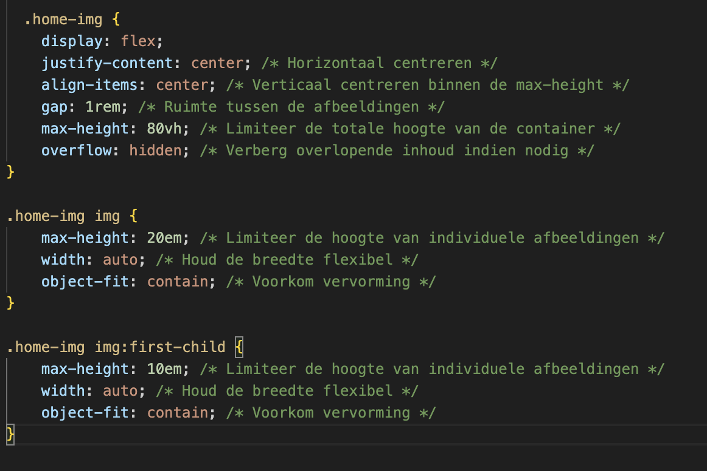
   poging 2:
  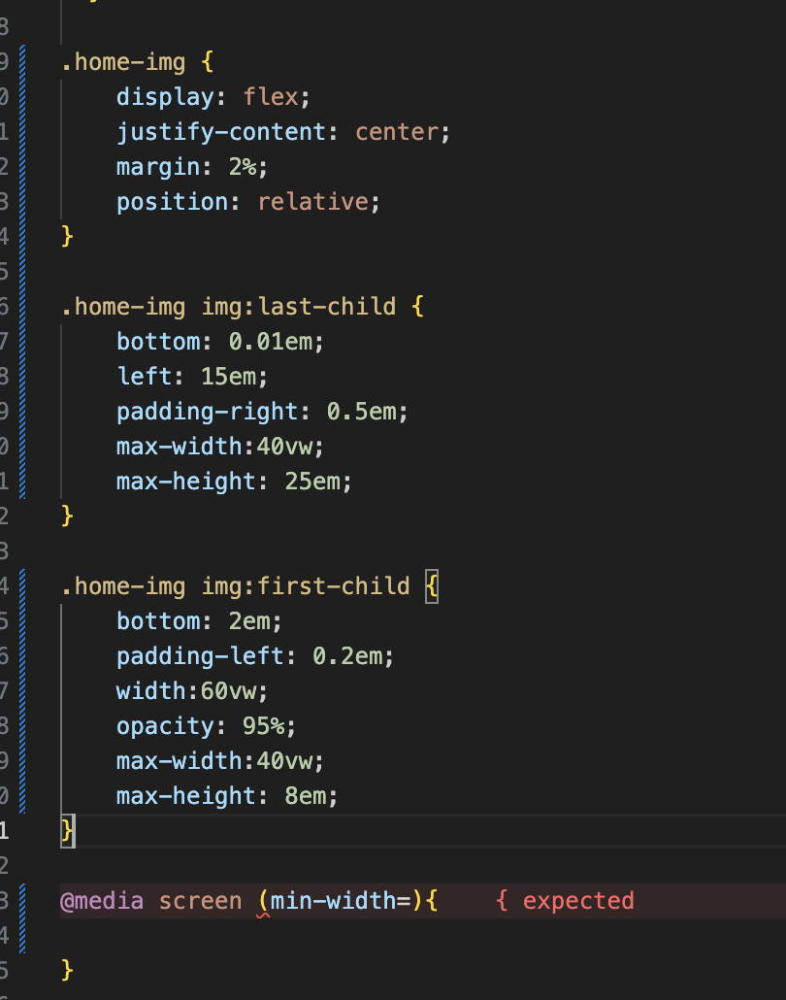
    poging 3:
  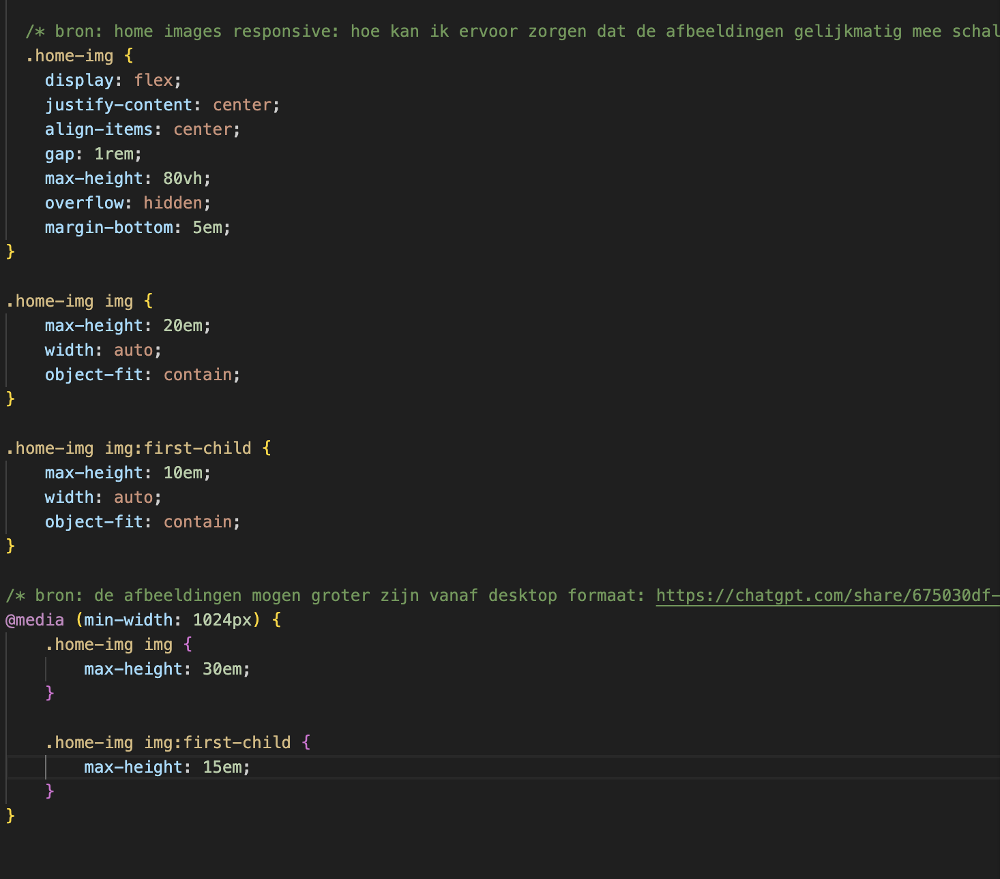
  
  Gewerkt aan maken hamburger menu, mobile screen:
  Poging 1:
  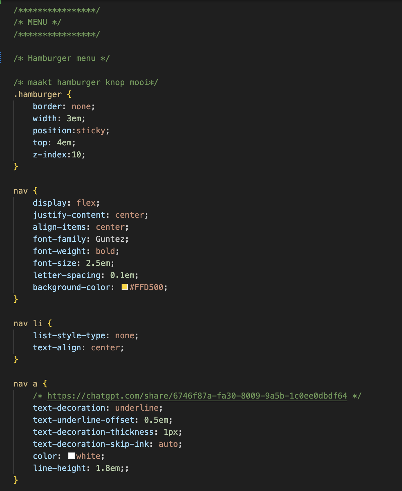
    Poging 2:
  
  En heb nog veeeeeeeeel meer geprobeerd, maar dat is allemaal niet gelukt :'D 
  moet hier nog maar een keer goed naar kijken: https://css-tricks.com/hamburger-menu-with-a-side-of-react-hooks-and-styled-components/

  responsive maken van de 3 blokjes Dopple shop,Prints & Design:
  Bijna gehele css code om dit voor elkaar te krijgen:
  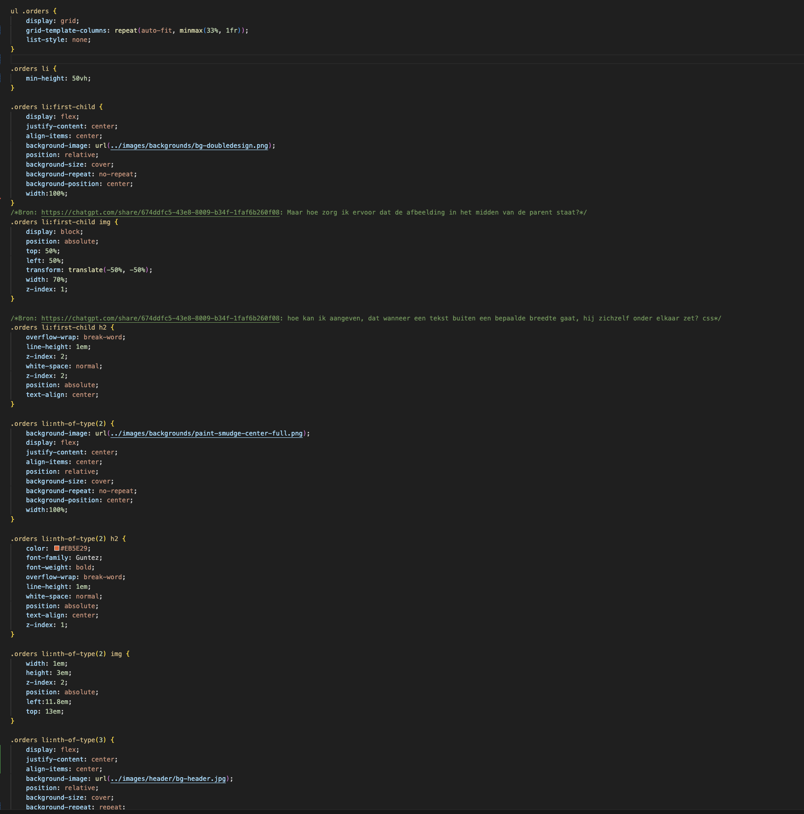

  Grid proberen te maken in kopje RISOPRINT 
  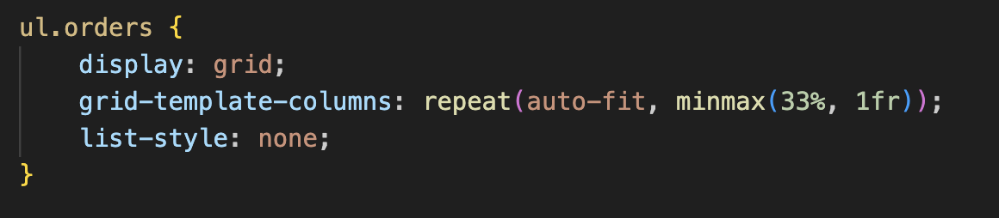
  wanneer je display: block; uitzet, werkt de hele code niet meer, ookal staat er in de inspector op de browser dat dit de reden is dat de code niet werkt.

  Grid maken in risography:
  Poging 1: bron gebruikt: https://chatgpt.com/share/67518189-0fbc-8009-b53e-b7cb75eb1c12
  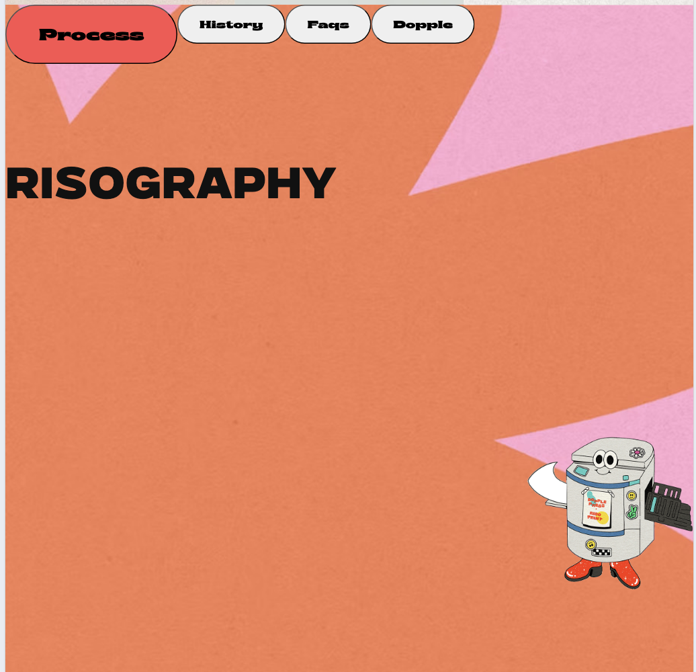
  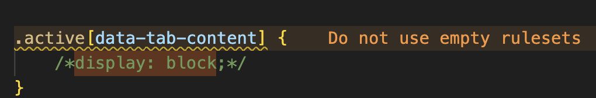
  mislukt!  
  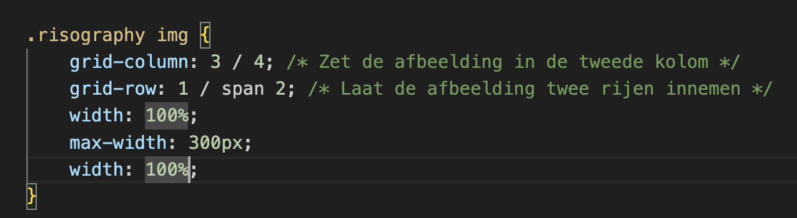
  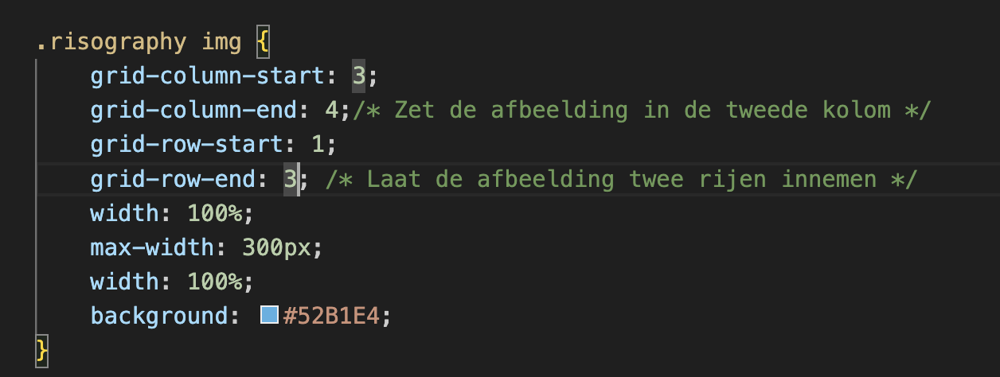
  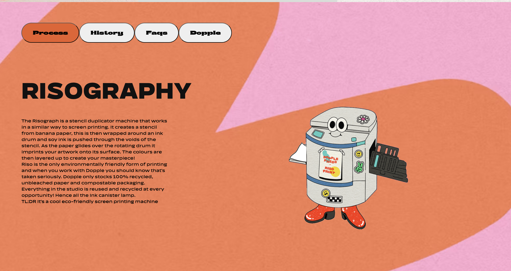
  Bijna goed. Hoe selecteer je de tekst in een button?

  ### Agenda voor meeting
  • Hoe kan ik de tekst van buttons specifiek targetten?
  • Hoe zorgen dat de afbeelding naast de tekst komt te staan? (dit is denk ik al opgelost met grid)
  • Regualr is geen geldige css waarde??
  • Snap nog steeds niks van hamburger menu, en de animatie werkt niet, zoals in mijn bron.. help?
  • Foutmelding, mag geen span gebruikenom text kleur oranje te maken, wat moet veranderd?
  • Hele lange naam voor de fonts die ik heb gedownload van de site. Geen idee daarom welke font wat doet. Ik houd gewoon de fonts die ik al had gevonden met typefinder.

  ### Verslag van meeting
  hier na afloop snel de uitkomsten van de meeting vastleggen

  - Alex
  Het moet idd een section zijn. Misschien is het en radio button. Probeer het als een formulier in te vullen. In dit geval zou je goed met end of type selector kunnen werken. De light dark modus is soms allebei tegelijk te zien. Waarom niet eentje? is het een idee om e svg'tjes in een bestand te plaatsen, ipv zo'n hele langer regel. In jouw css zou je een class hide moeten hebben. Voeg die toe. Heb je een class 'sun' en 'moon' in je styling staan. je gebruikt een aantal classes, maar je classes hebben geen stijling. Voor de const light en dark mode kun je beter #id;s gebruiken. Probleem met scrollen hamburger menu. Het probleem is toevoegen: overflow: scroll;
  Slimmer om svg in bestandje te zetten in image sources te doen (src). Minder gespecialceerd in foutcode in css. Is niet altijd bij de tijd met css. Je kunt de fout wel oplossen. Valideren HTML is wel belangrijk. Heeft betekenis, structuur. Css heeft dat niet. 
  Screenreader pakt geen p's. Tab is geen screenreader. Het is en browser toets die tussen de linksjes springt. Tab zit in de browser. Niet de screenreader. Met de screenreader kun je veel meer. In het mondeling wordt dit ook gevraagd. Bij de bronnen staan ook screan reader shortcuts en hoe het werkt. In week 1 of 2. Er is veel meer control toetsen. Je hoeft ze niet allemaal uit je hoofd te leren, maar oefen er wel mee. h, voor headings etc. 

  - Maaike
  waarom zoveel lege ruimte onder risography? teveel rows. normal en bold zijn geldige waardes. of een van deze 100. en 400 komt overeen met normal. wajamaifondue.com. Span kan beter een class style zijn, of in css worden aangepast met een selector. --custom properties. translate, rotate, dan kkom je dat, geen divjes nodig. 

  - Alyaman
  signaar van missende hf in een section. Section is een hoofdstuk in je boek. Als je hoofdstuk geen titel heeft, is het lastig te zien waar je bent. Het idee is dat het heel fijn is om een heading te maken bij een section. Is het logisch dat hij daar staat. Je hebt er goed overnagedacht, het is echt een section, je kan heading vershuilen met zoals de h1. Flex direction:column; eruit halen omdat het niet het efect geeft dat je wilt. Advies om te beginnen met mobile first. En de @media encoder laat iets anders zien. @media zou je ook andersom kunnen doen. makkerlijk te beginnen met klein first en groter later. Zou het nu niet veranderen, want dan moet je alles opnieuw maken :D. Hover knop. Pijl is wel gelukt, maar de border van svg niet gelukt. Ze hebben een svg, en ze hebben het path van de svg niet gelukt. Misschien kun je zelf een leuke animatie bedenken die je zelf kunt doen. bijvoorbeeld rainbow ding. Maak je eigen leuke ding dat je zelf kunt bouwen met de css wat voor jou haalbaar is. Donker filter over hele img. Week 3 positioneren. Het is een positioneren optie. Backdrop filter blurr. Er is een blokje, en dan positioneer die als blokjes met position absolute. Het idee is dat er het in blokje een opacity zit. 
  - Sharlainy
  stray div betekend dat je een div sluit die niet open is. Navigatiebolletjes: buttons zijn zichtbaar en die wil ik weg hebben. Je kunt de tekst in de buttons gewoon weg halen. je kan ipv daarvan aria labels. Als het een plaatje is voeg een alt tag toe. Aria voeg informatie toe voor de screenreader.string toeveogen om naam erin te zetten. Je kan aria label ook toevoegen aan hamburger menu. Er zijn een stuk of 20/30 aria tags dus er  is genoeg om uit te kiezen. 

## Eindgesprek (week 5)

  
uitwerken voor eindgesprek

  ### Je uitkomst - karakteristiek screenshots:
  

  ### Dit ging goed/Heb ik geleerd: 
  <b>Geleerd</b>
  • Ik heb geleerd met grids om te gaan. 
  • Ik heb geleerd dat je flexbox en grids kunt combineren.
  • Ik heb geleerd hoe positioneren werkt.
  • Ik heb geleerd dat je als je iets opzoekt, je het echt tot de kern moet begrijpen om het opnieuw en juist te kunnen toepassen.
  • Ik heb geleerd dat coderen volledige aandacht nodig heeft, en dat de enige manier om het te leren is, door het vaak te doen en te begrijpen wat je doet.
  • Ik heb geleerd om in het box model te denken.
  • Ik heb een beetje meer begrip voor javascript.
  • consol log() testen nadat je de const, of andere dingest hebt geschreven, en niet bovenaan je pagina (tenzij test om te zien of je js is gelinked met dom).
  • Ik heb geleerd waar je op moet letten om een site toegankelijk te maken voor zoveel mogelijk verschillende doelgroepen, en beperkingen. Ook geleerd waar je een lijst kan vinden waar al deze informatie duidelijk staat vermeld.

  <b>Wat ging goed</b>
  • Het maken van de oefeningen in de les goed (op het maken van het hamburger menu, na).
  • Het stellen van vragen en feedback is goed gegaan.

  

  ### Dit was lastig/Is niet gelukt:
 • Wat ik lastig vond was om de juiste informatie bij de juiste bron vandaan te halen. En als ik het bij een bron vandaan haalde en zonder na denken kopieer en plak, ik nog steeds geen idee heb wat er is gebeurd. 
 • Heel tijdrovend om te begrijpen wat je doet, wat de code doet die je kopieerd en plakt, of zelf maakt en test. En test. En test. 
 • Het maken van een hamburger menu. Zoveel verschillende variaties, nergens een korte beschrijving, en geen short cuts.
 • Misschien een te moeilijke website gekozen? Misschien mezelf te hoog ingeschat? Misschien ben ik piste blauw ipv piste rood?
 • Het toepassen van wat we hebben geleerd in de lessen vond ik soms moeilijk.
 • Het opzoeken van informatie buiten de lessen, maar die ik wel nodig had in mijn code, en wilde begrijpen vond ik lastig. Filmpjes die langer dan uur duren, maar wel goede uitleg geven. De uitleg dan alsnog niet snappen en vergeten...
 • Lastig dat de lessen altijd midden op de dag werden gegeven. Hierdoor was het moeilijk om in een goede 'flow' te komen en lekker een paar uurtjes te knallen. In de ochtend kun je misschien net een of twee uur aan de website werken. Kom je thuis, is het rond 17:00 uur. Eten om 18:00 uur, trainen om 20:00 of 17:00 uur. En als je dan weer thuis bent... dan wil je slapen. Weekend vol in december/november. Lastig om zo aan school te werken en meters/uren te maken.
 • Het ene moment gevoel dat ik het helemaal snap en alles logisch vind. Het volgende moment geen idee waarom dezelfde formulie niet werkt op een ander onderdeel. lol.

  

## Eindgesprek (week 5)

  
 
Grid maken voor pagina 2: Shop.

  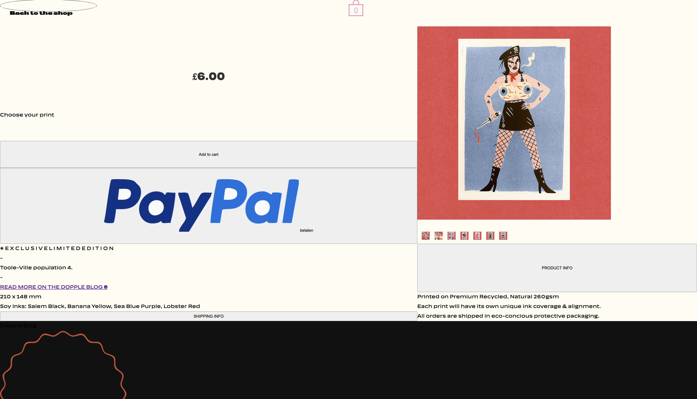
  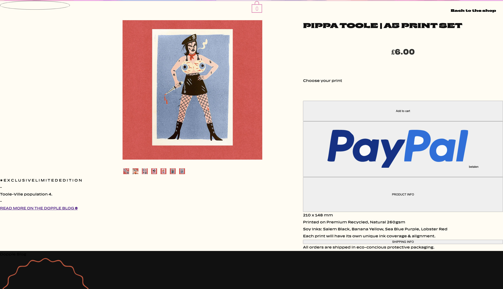
  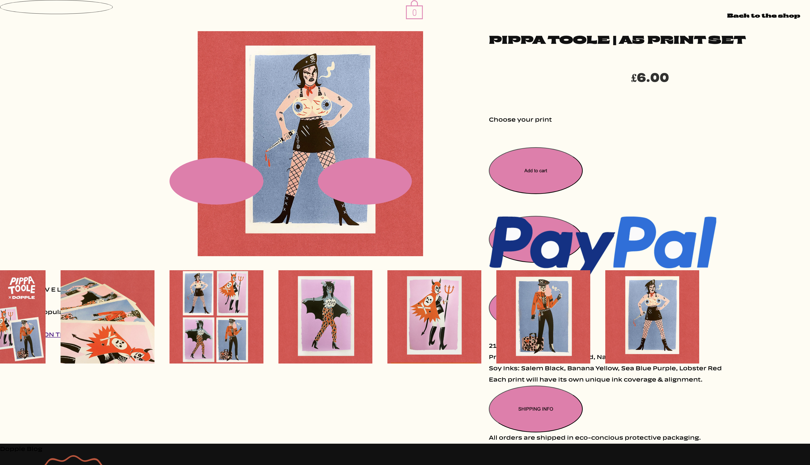
  Hierom denk ik dat een class toevoegen hadiger is.
   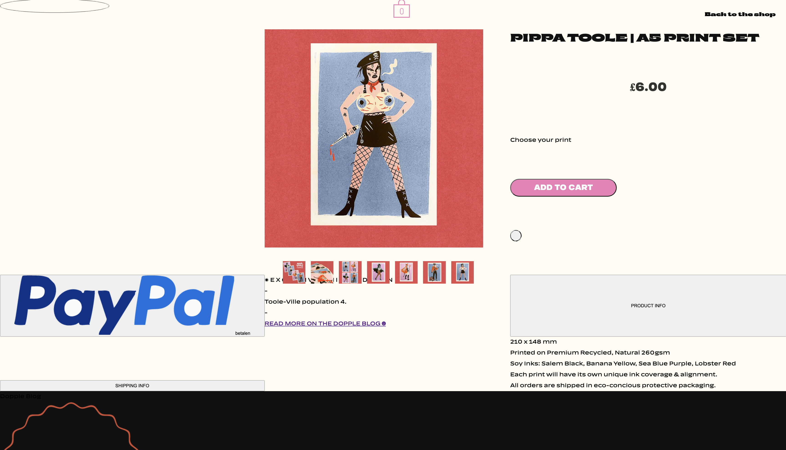
   toch maar een divje om de knoppen doen zodat ik ze naast elkaar kan zetten.
    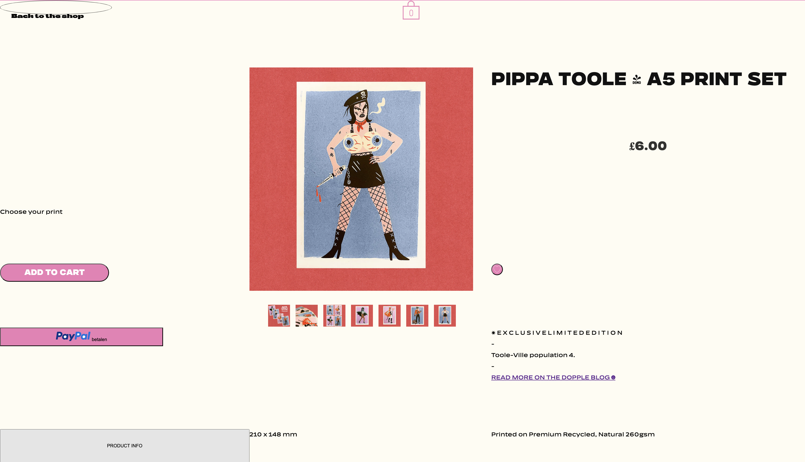

  

## Bronnenlijst

  
continu bijhouden terwijl je werkt

  Nb. Wees specifiek ('css-tricks' als bron is bijv. niet specifiek genoeg). 
  Nb. ChatGpT en andere AI horen er ook bij.
  Nb. Vermeld de bronnen ook in je code.

  1. Bronnen staan bij de code
  2. bron 2
  3. ...

